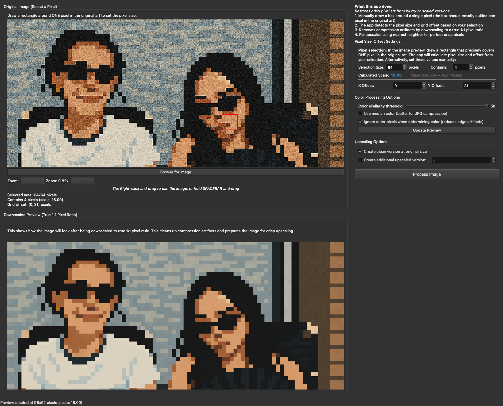

# Pixel Art Scaler

A Python application that restores the crispness of pixel art images that have been shared online by detecting scale, removing compression artifacts, and reupscaling with nearest neighbor interpolation.



## Features

- Corrects grid alignment offset
- Downscales to true 1:1 pixel ratio to rescale
- Re-upscales using nearest neighbor for perfect pixel edges
- Creates both clean 1:1 version and upscaled versions
- Preserves transparency
- Exports to PNG format
- Modern Qt-based GUI with PySide6
- Command-line interface for batch processing

## Installation

### Quick Start

1. Install `uv` (if you don't have it):
   Mac and Linux
   ```bash
   curl -sSf https://astral.sh/uv/install.sh | sh
   ```
   Windows
   ```powershell
   iwr https://astral.sh/uv/install.ps1 -useb | iex
   ```
   Follow the on-screen instructions to add `uv` to your PATH.

2. Run the GUI application:
   ```bash
   uvx --from git+https://github.com/wjhrdy/pixel-art-scaler pixel-art-scaler
   ```

## Why Use Pixel Art Scaler

When pixel art is shared on social media platforms, the original crisp pixel edges are often lost due to:
1. Compression artifacts (especially in JPG format)
2. Platform-specific image processing
3. Loss of the original pixel grid alignment

This app restores pixel art to its intended appearance by:
1. Allowing the user to select original pixel scale and offset
2. Downscaling to true 1:1 pixel ratio to remove artifacts
3. Re-upscaling with nearest neighbor interpolation for perfect crisp pixels

The result is perfect for sharing on social media without losing the distinctive pixel art aesthetic.

## Requirements

- Python 3.8+
- Pillow
- NumPy
- SciPy
- PySide6 (for GUI version)